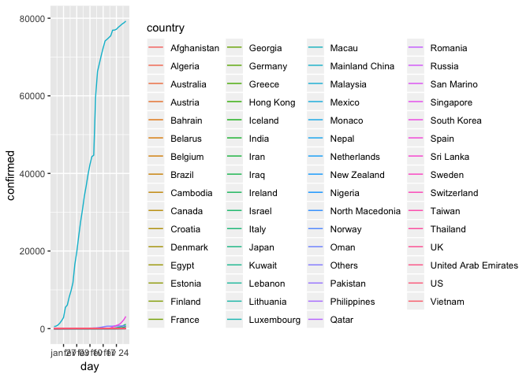
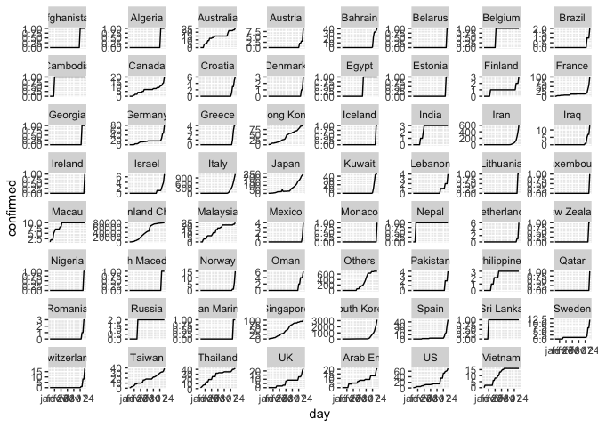
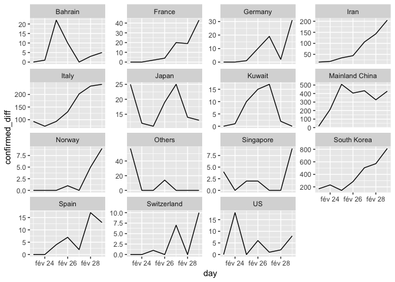
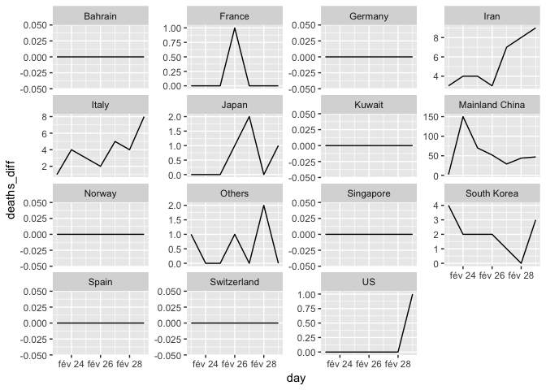
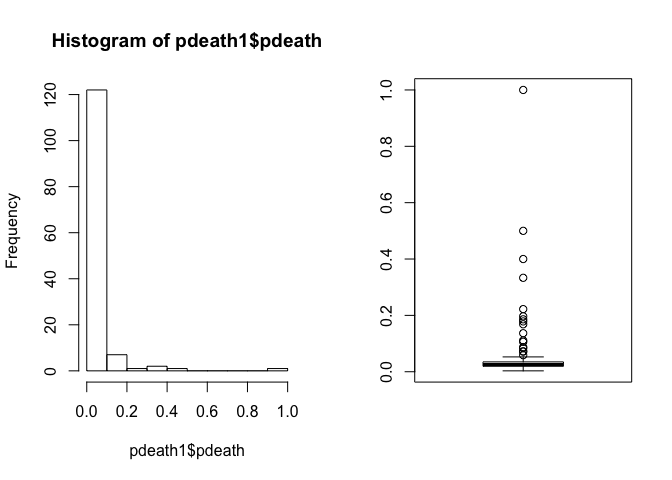
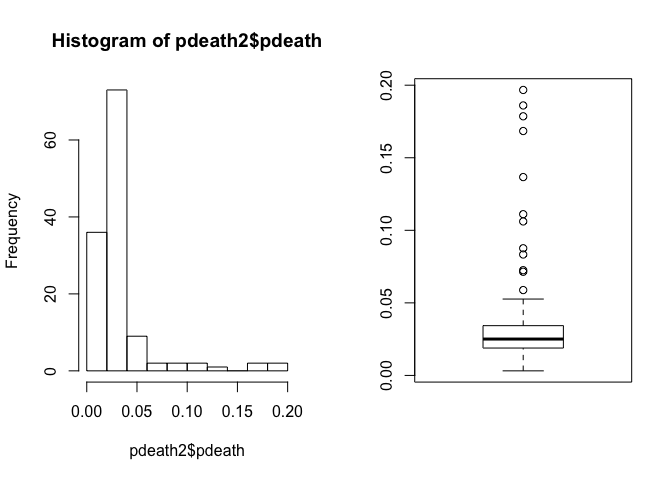
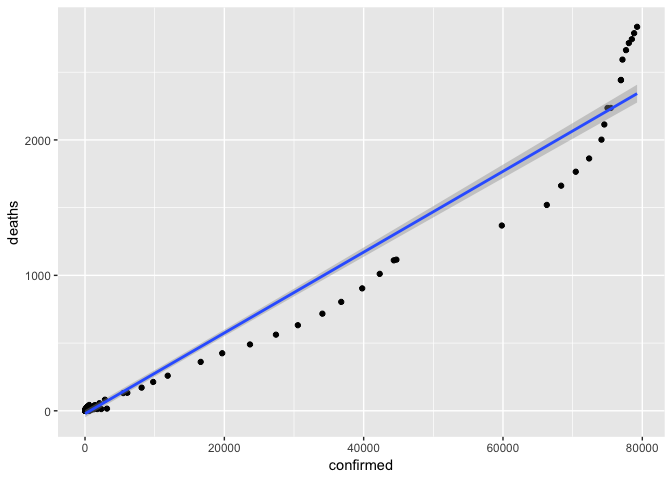
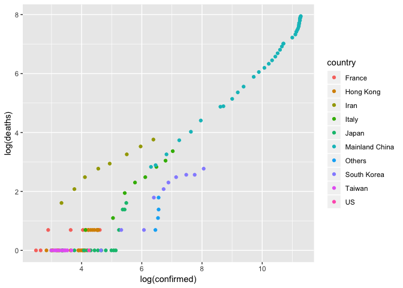

Lecture 5
================

Read the new Covid-19
    data

``` r
library(tidyverse)
```

    ## ── Attaching packages ───────────────────────────────────────────────────────────────────────────── tidyverse 1.2.1 ──

    ## ✔ ggplot2 3.1.0     ✔ purrr   0.3.1
    ## ✔ tibble  2.1.3     ✔ dplyr   0.8.4
    ## ✔ tidyr   1.0.2     ✔ stringr 1.4.0
    ## ✔ readr   1.3.1     ✔ forcats 0.4.0

    ## ── Conflicts ──────────────────────────────────────────────────────────────────────────────── tidyverse_conflicts() ──
    ## ✖ dplyr::filter() masks stats::filter()
    ## ✖ dplyr::lag()    masks stats::lag()

``` r
dt_confirmed <- read.csv("https://raw.githubusercontent.com/CSSEGISandData/COVID-19/master/csse_covid_19_data/csse_covid_19_time_series/time_series_19-covid-Confirmed.csv", stringsAsFactors = FALSE)

dt_deaths <- read.csv("https://raw.githubusercontent.com/CSSEGISandData/COVID-19/master/csse_covid_19_data/csse_covid_19_time_series/time_series_19-covid-Deaths.csv", stringsAsFactors = FALSE)

dt_recovered <- read.csv("https://raw.githubusercontent.com/CSSEGISandData/COVID-19/master/csse_covid_19_data/csse_covid_19_time_series/time_series_19-covid-Recovered.csv", stringsAsFactors = FALSE)
```

Check whether the structure is the same

``` r
sapply(list(dt_confirmed, dt_deaths, dt_recovered), colnames)
```

    ##       [,1]             [,2]             [,3]            
    ##  [1,] "Province.State" "Province.State" "Province.State"
    ##  [2,] "Country.Region" "Country.Region" "Country.Region"
    ##  [3,] "Lat"            "Lat"            "Lat"           
    ##  [4,] "Long"           "Long"           "Long"          
    ##  [5,] "X1.22.20"       "X1.22.20"       "X1.22.20"      
    ##  [6,] "X1.23.20"       "X1.23.20"       "X1.23.20"      
    ##  [7,] "X1.24.20"       "X1.24.20"       "X1.24.20"      
    ##  [8,] "X1.25.20"       "X1.25.20"       "X1.25.20"      
    ##  [9,] "X1.26.20"       "X1.26.20"       "X1.26.20"      
    ## [10,] "X1.27.20"       "X1.27.20"       "X1.27.20"      
    ## [11,] "X1.28.20"       "X1.28.20"       "X1.28.20"      
    ## [12,] "X1.29.20"       "X1.29.20"       "X1.29.20"      
    ## [13,] "X1.30.20"       "X1.30.20"       "X1.30.20"      
    ## [14,] "X1.31.20"       "X1.31.20"       "X1.31.20"      
    ## [15,] "X2.1.20"        "X2.1.20"        "X2.1.20"       
    ## [16,] "X2.2.20"        "X2.2.20"        "X2.2.20"       
    ## [17,] "X2.3.20"        "X2.3.20"        "X2.3.20"       
    ## [18,] "X2.4.20"        "X2.4.20"        "X2.4.20"       
    ## [19,] "X2.5.20"        "X2.5.20"        "X2.5.20"       
    ## [20,] "X2.6.20"        "X2.6.20"        "X2.6.20"       
    ## [21,] "X2.7.20"        "X2.7.20"        "X2.7.20"       
    ## [22,] "X2.8.20"        "X2.8.20"        "X2.8.20"       
    ## [23,] "X2.9.20"        "X2.9.20"        "X2.9.20"       
    ## [24,] "X2.10.20"       "X2.10.20"       "X2.10.20"      
    ## [25,] "X2.11.20"       "X2.11.20"       "X2.11.20"      
    ## [26,] "X2.12.20"       "X2.12.20"       "X2.12.20"      
    ## [27,] "X2.13.20"       "X2.13.20"       "X2.13.20"      
    ## [28,] "X2.14.20"       "X2.14.20"       "X2.14.20"      
    ## [29,] "X2.15.20"       "X2.15.20"       "X2.15.20"      
    ## [30,] "X2.16.20"       "X2.16.20"       "X2.16.20"      
    ## [31,] "X2.17.20"       "X2.17.20"       "X2.17.20"      
    ## [32,] "X2.18.20"       "X2.18.20"       "X2.18.20"      
    ## [33,] "X2.19.20"       "X2.19.20"       "X2.19.20"      
    ##  [ reached getOption("max.print") -- omitted 10 rows ]

Convert to the long format and combine

``` r
library(tidyr)
library(lubridate)
```

    ## 
    ## Attaching package: 'lubridate'

    ## The following object is masked from 'package:base':
    ## 
    ##     date

``` r
dt_confirmed_long <- dt_confirmed %>% pivot_longer(cols = starts_with("X"), names_to = "day", values_to = "confirmed")

dt_deaths_long <- dt_confirmed %>% pivot_longer(cols = starts_with("X"), names_to = "day", values_to = "deaths")

dt_deaths_long <- dt_deaths %>% pivot_longer(cols = starts_with("X"), names_to = "day", values_to = "deaths")

dt_recovered_long <- dt_recovered %>% pivot_longer(cols = starts_with("X"), names_to = "day", values_to = "recovered")

covid_raw <- dt_confirmed_long %>% 
    inner_join(dt_deaths_long %>% select(-Lat,-Long), by = c("Province.State", "Country.Region", "day")) %>% 
    inner_join(dt_recovered_long %>% select(-Lat,-Long), by = c("Province.State", "Country.Region", "day"))

covid <- covid_raw %>% mutate(day = mdy(paste0(gsub("X","", day),"20")))

colnames(covid) <- tolower(colnames(covid))
colnames(covid)[1:2] <- c("region","country")
covid
```

    ## # A tibble: 4,641 x 8
    ##    region country          lat  long day        confirmed deaths recovered
    ##    <chr>  <chr>          <dbl> <dbl> <date>         <int>  <int>     <int>
    ##  1 Anhui  Mainland China  31.8  117. 2020-01-22         1      0         0
    ##  2 Anhui  Mainland China  31.8  117. 2020-01-23         9      0         0
    ##  3 Anhui  Mainland China  31.8  117. 2020-01-24        15      0         0
    ##  4 Anhui  Mainland China  31.8  117. 2020-01-25        39      0         0
    ##  5 Anhui  Mainland China  31.8  117. 2020-01-26        60      0         0
    ##  6 Anhui  Mainland China  31.8  117. 2020-01-27        70      0         0
    ##  7 Anhui  Mainland China  31.8  117. 2020-01-28       106      0         0
    ##  8 Anhui  Mainland China  31.8  117. 2020-01-29       152      0         2
    ##  9 Anhui  Mainland China  31.8  117. 2020-01-30       200      0         2
    ## 10 Anhui  Mainland China  31.8  117. 2020-01-31       237      0         3
    ## # … with 4,631 more rows

Aggregate by
country

``` r
covid_country <- covid %>% select(-lat, -long, -region) %>% group_by(country, day) %>% summarise_all(sum) %>% ungroup %>% arrange(country,day)
covid_country
```

    ## # A tibble: 2,457 x 5
    ##    country     day        confirmed deaths recovered
    ##    <chr>       <date>         <int>  <int>     <int>
    ##  1 Afghanistan 2020-01-22         0      0         0
    ##  2 Afghanistan 2020-01-23         0      0         0
    ##  3 Afghanistan 2020-01-24         0      0         0
    ##  4 Afghanistan 2020-01-25         0      0         0
    ##  5 Afghanistan 2020-01-26         0      0         0
    ##  6 Afghanistan 2020-01-27         0      0         0
    ##  7 Afghanistan 2020-01-28         0      0         0
    ##  8 Afghanistan 2020-01-29         0      0         0
    ##  9 Afghanistan 2020-01-30         0      0         0
    ## 10 Afghanistan 2020-01-31         0      0         0
    ## # … with 2,447 more rows

Calculate absolute growths and percentage growths

``` r
growth <- function(x) c(NA, diff(x)/x[-length(x)])
agrowth <- function(x)c(NA, diff(x))

covid_country <- covid_country %>% group_by(country) %>% mutate_at(c("confirmed", "deaths", "recovered"), list(diff = agrowth, growth = growth))
covid_country
```

    ## # A tibble: 2,457 x 11
    ## # Groups:   country [63]
    ##    country day        confirmed deaths recovered confirmed_diff deaths_diff
    ##    <chr>   <date>         <int>  <int>     <int>          <int>       <int>
    ##  1 Afghan… 2020-01-22         0      0         0             NA          NA
    ##  2 Afghan… 2020-01-23         0      0         0              0           0
    ##  3 Afghan… 2020-01-24         0      0         0              0           0
    ##  4 Afghan… 2020-01-25         0      0         0              0           0
    ##  5 Afghan… 2020-01-26         0      0         0              0           0
    ##  6 Afghan… 2020-01-27         0      0         0              0           0
    ##  7 Afghan… 2020-01-28         0      0         0              0           0
    ##  8 Afghan… 2020-01-29         0      0         0              0           0
    ##  9 Afghan… 2020-01-30         0      0         0              0           0
    ## 10 Afghan… 2020-01-31         0      0         0              0           0
    ## # … with 2,447 more rows, and 4 more variables: recovered_diff <int>,
    ## #   confirmed_growth <dbl>, deaths_growth <dbl>, recovered_growth <dbl>

Plot all of the
countries

``` r
ggplot(aes(x = day, y = confirmed, colour = country), data = covid_country) + geom_line()
```

<!-- -->

Plot all of the countries one by
one

``` r
ggplot(aes(x = day, y = confirmed), data = covid_country) + geom_line() + facet_wrap(~country, scales="free_y")
```

<!-- -->

Select only countries with 10 cases in the last 7
days

``` r
day7 <- covid_country %>% filter(day <= max(day) & day > max(day) - 7) %>% group_by(country) %>% summarize(max_cases = max(confirmed_diff)) %>% filter( max_cases > 7)
day7 %>% arrange(-max_cases)
```

    ## # A tibble: 15 x 2
    ##    country        max_cases
    ##    <chr>              <int>
    ##  1 South Korea          813
    ##  2 Mainland China       508
    ##  3 Italy                240
    ##  4 Iran                 205
    ##  5 Others                57
    ##  6 France                43
    ##  7 Germany               31
    ##  8 Japan                 25
    ##  9 Bahrain               22
    ## 10 US                    18
    ## 11 Kuwait                17
    ## 12 Spain                 17
    ## 13 Switzerland           10
    ## 14 Norway                 9
    ## 15 Singapore              9

Plot the growths for these
cases

``` r
ggplot(aes(x = day, y = confirmed_diff), data = covid_country %>% filter(country %in% day7$country) %>% filter(day > max(day) - 7)) + geom_line() + facet_wrap(~country, scales="free_y")
```

<!-- -->

Plot the deaths for selected
countries

``` r
ggplot(aes(x = day, y = deaths_diff), data = covid_country %>% filter(country %in% day7$country) %>% filter(day > max(day) - 7)) + geom_line() + facet_wrap(~country, scales="free_y")
```

<!-- -->

Inspect death percentage
variation

``` r
pdeath <- covid_country %>% mutate(pdeath = deaths/confirmed) %>% filter(pdeath > 0) %>% 
    select(country, day, deaths, confirmed, pdeath) 
pdeath
```

    ## # A tibble: 180 x 5
    ## # Groups:   country [11]
    ##    country day        deaths confirmed pdeath
    ##    <chr>   <date>      <int>     <int>  <dbl>
    ##  1 France  2020-02-15      1        12 0.0833
    ##  2 France  2020-02-16      1        12 0.0833
    ##  3 France  2020-02-17      1        12 0.0833
    ##  4 France  2020-02-18      1        12 0.0833
    ##  5 France  2020-02-19      1        12 0.0833
    ##  6 France  2020-02-20      1        12 0.0833
    ##  7 France  2020-02-21      1        12 0.0833
    ##  8 France  2020-02-22      1        12 0.0833
    ##  9 France  2020-02-23      1        12 0.0833
    ## 10 France  2020-02-24      1        12 0.0833
    ## # … with 170 more rows

Select only unique
points

``` r
pdeath1 <- covid_country %>% select(country, confirmed, deaths) %>% unique %>% mutate(pdeath = deaths/confirmed) %>% filter(confirmed > 0) %>% filter(pdeath>0)
pdeath1
```

    ## # A tibble: 134 x 4
    ## # Groups:   country [11]
    ##    country   confirmed deaths pdeath
    ##    <chr>         <int>  <int>  <dbl>
    ##  1 France           12      1 0.0833
    ##  2 France           14      1 0.0714
    ##  3 France           18      2 0.111 
    ##  4 France           38      2 0.0526
    ##  5 France           57      2 0.0351
    ##  6 France          100      2 0.02  
    ##  7 Hong Kong        17      1 0.0588
    ##  8 Hong Kong        21      1 0.0476
    ##  9 Hong Kong        24      1 0.0417
    ## 10 Hong Kong        25      1 0.04  
    ## # … with 124 more rows

Explore distribution

``` r
par(mfrow = c(1, 2))
hist(pdeath1$pdeath)
boxplot(pdeath1$pdeath)
```

<!-- -->

Inspect outliers

``` r
pdeath1 %>% filter(pdeath>0.2)
```

    ## # A tibble: 5 x 4
    ## # Groups:   country [2]
    ##   country     confirmed deaths pdeath
    ##   <chr>           <int>  <int>  <dbl>
    ## 1 Iran                2      2  1    
    ## 2 Iran                5      2  0.4  
    ## 3 Iran               18      4  0.222
    ## 4 Philippines         2      1  0.5  
    ## 5 Philippines         3      1  0.333

On which days it has occured?

``` r
pdeath %>% filter(pdeath>0.2)
```

    ## # A tibble: 31 x 5
    ## # Groups:   country [2]
    ##    country     day        deaths confirmed pdeath
    ##    <chr>       <date>      <int>     <int>  <dbl>
    ##  1 Iran        2020-02-19      2         2  1    
    ##  2 Iran        2020-02-20      2         5  0.4  
    ##  3 Iran        2020-02-21      4        18  0.222
    ##  4 Philippines 2020-02-02      1         2  0.5  
    ##  5 Philippines 2020-02-03      1         2  0.5  
    ##  6 Philippines 2020-02-04      1         2  0.5  
    ##  7 Philippines 2020-02-05      1         2  0.5  
    ##  8 Philippines 2020-02-06      1         2  0.5  
    ##  9 Philippines 2020-02-07      1         3  0.333
    ## 10 Philippines 2020-02-08      1         3  0.333
    ## # … with 21 more rows

Explore distributions with outliers removed

``` r
pdeath2 <- pdeath1 %>% filter(pdeath < 0.2)
par(mfrow = c(1, 2))
hist(pdeath2$pdeath)
boxplot(pdeath2$pdeath)
```

<!-- -->

Do a scatter
plot

``` r
ggplot(aes(x = confirmed, y = deaths), data = pdeath2) + geom_point() + geom_smooth(method="lm")
```

<!-- -->

``` r
ggplot(aes(x = log(confirmed), y = log(deaths)), data = pdeath2) + geom_point(aes(colour=country)) 
```

<!-- -->
